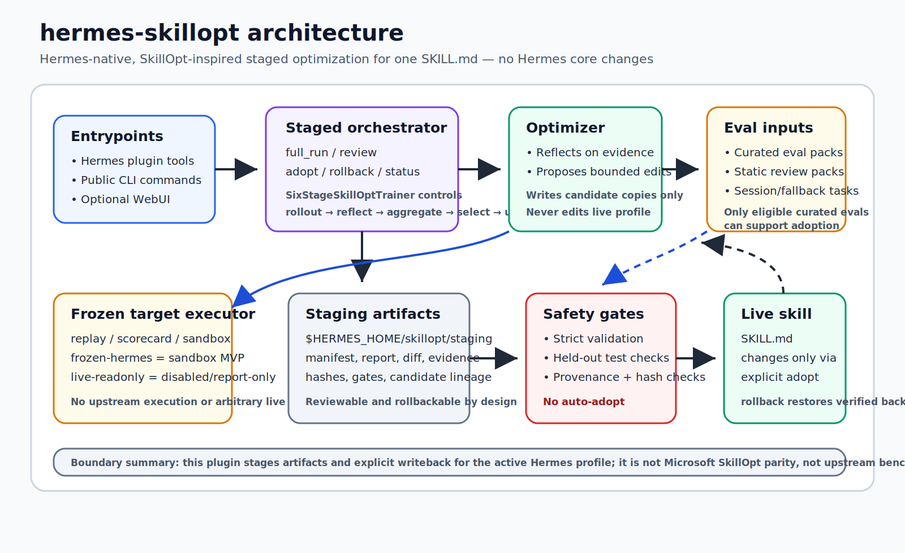
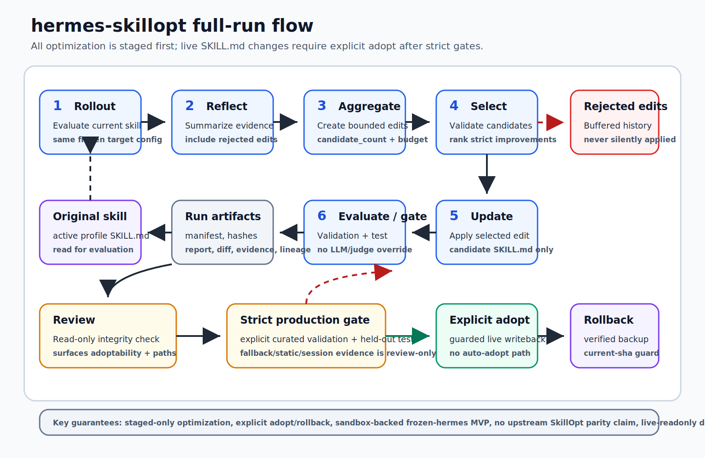

# hermes-skillopt

`hermes-skillopt` is a standalone Hermes plugin for safe, staged optimization of a Hermes profile `SKILL.md`. It is **not** a fork or full port of Microsoft SkillOpt; it is a Hermes-native adapter that keeps Hermes core unchanged and keeps all candidate changes reviewable and rollbackable.

## Diagrams

The README diagrams are deterministic SVG/vector assets with large text and high-contrast labels so they stay sharp in GitHub rendering and can be opened directly for zooming.



[Open high-resolution architecture SVG](docs/assets/hermes-skillopt-architecture.svg)



[Open high-resolution flow SVG](docs/assets/hermes-skillopt-flow.svg)

## What it is

- **Trainable state:** one Hermes skill document (`$HERMES_HOME/skills/.../SKILL.md`).
- **Frozen target executor:** evaluates the current skill and each candidate under the same replay/scorecard/sandbox target config. `frozen-hermes` / `frozen_hermes_target_execution_v1` is an MVP alias for the isolated sandbox runner with frozen-target evidence fingerprints; it is not true upstream benchmark parity or arbitrary live Hermes command execution. A disabled-by-default `live-readonly` interface remains report-only unless a future real Hermes runtime adapter supplies the required proof.
- **Optimizer:** reflects on rollout evidence and proposes bounded skill edits only. It does not write the live profile.
- **Environment/benchmark:** builds train/validation/test tasks from explicit curated eval files, bundled static review eval packs, session-mined snippets, and fallback synthetic tasks.
- **Gate:** validation defaults to strict mode. Production adoption additionally requires explicit curated validation and held-out test eligibility; soft/mixed gates and static/keyword packs are review-only/non-production.
- **Safety shell:** full runs write only staged artifacts; live writes require explicit `adopt`; `rollback` restores from guarded backups. Report/eval outputs share a safe path guard that rejects live/runtime-sensitive profile/plugin/source paths and symlink escapes.

## What it is not

- Not Microsoft’s official SkillOpt trainer/package.
- Not an arbitrary command runner. Sandbox eval blocks task-provided commands by default.
- Not an auto-adopter. Production tool/CLI/WebUI flows do not auto-adopt.
- Not a way to production-adopt fallback, synthetic, session-mined, or legacy dry-run proposals.
- Not a benchmark-results claim. `benchmark`/`eval-only`, benchmark bridge, and transfer eval produce local deterministic artifacts/reports; they do not prove parity with Microsoft SkillOpt benchmarks or external model performance.
- `full-run --dry-run` does not exist; use `dry-run`/`run --mode legacy` only for review-only legacy proposals.

## Install

From this repo:

```bash
cd /Users/fanxuxin/Hermes_Sync/Default/hermes-skillopt
bash scripts/install_local.sh
```

This creates a symlink at `${HERMES_HOME:-$HOME/.hermes}/plugins/hermes-skillopt`. Restart/reload any already-running Hermes session if it does not pick up the plugin.

Optional editable Python install for CLI/WebUI development:

```bash
python3 -m pip install -e '.[dev]'
python3 -m pip install -e '.[webui]'
```

## Tools

Toolset: `hermes_skillopt`

- `hermes_skillopt_status`: profile, skill count, recent staged runs, artifact lineage summaries, and stale/incomplete checkpoint rows with cleanup guidance.
- `hermes_skillopt_run`: defaults to `mode="full"`; `mode="legacy"` calls the legacy review-only dry-run path.
- `hermes_skillopt_full_run`: executes the current six-stage SkillOpt-inspired lifecycle.
- `hermes_skillopt_resume_inspect`: read-only checkpoint/stage fingerprint inspection; completed-run reuse only, no partial replay or unsafe partial continuation.
- `hermes_skillopt_dry_run`: legacy staged proposal; review-only.
- `hermes_skillopt_review`: verifies artifact hashes and returns gate/adoptability status, lineage, report/diff paths, artifact refs, and previews; `slim=true` omits large previews and returns path/hash/byte references.
- `hermes_skillopt_adopt`: explicit live writeback after all guards pass; no `hermes_home` override in the tool schema.
- `hermes_skillopt_rollback`: explicit restore from verified backup manifest/SKILL.md; no `hermes_home` override in the tool schema.
- `hermes_skillopt_upstream_status`: local pinned upstream clone/lock status; no network fetch.
- `hermes_skillopt_upstream_update`: clone/fetch/pin Microsoft SkillOpt upstream metadata only; does not merge plugin code.
- `hermes_skillopt_import_upstream_benchmark`: safe JSON-only upstream-style manifest import into a Hermes eval pack; rejects executable/remote fields and live/runtime-sensitive output paths.
- `hermes_skillopt_transfer_eval`: read-only/report-only staged skill evaluation across deterministic target/profile configs; never writes live skills and uses the shared safe report output guard.
- `hermes_skillopt_conformance`: local quick/full compile/pytest conformance report; no upstream execution or external services; output uses the shared safe report path guard.
- `hermes_skillopt_handoff_optimize`: deterministic multi-agent `delegate_task` dispatcher→worker handoff package optimizer; staged output only.

P3 import/transfer/conformance surfaces are available both as Hermes plugin tools (`hermes_skillopt_import_upstream_benchmark`, `hermes_skillopt_transfer_eval`, `hermes_skillopt_conformance`) and as CLI/module commands (`import-upstream-benchmark`, `transfer-eval`, and `conformance`). `eval-only` and `benchmark` are currently CLI/core-only fixed-skill scoring surfaces.

Important full-run parameters:

- `skill`, `query`, `eval_file`, `lookback_days`, `limit`, `iterations`, `edit_budget`, `candidate_count`
- `backend`: `auto|hermes|mock` back-compat alias for the optimizer backend
- `optimizer_backend`: `auto|hermes|mock`; controls reflection/bounded edit proposal generation
- `allow_mock`: required before `backend=auto` may fall back to mock outside Hermes.
- `target_executor` / `target_backend`: `auto|replay|sandbox|scorecard|frozen-hermes|frozen_hermes_target_execution_v1|live-readonly`; controls the frozen evaluator, separate from the optimizer backend. `frozen-hermes` currently routes to the constrained sandbox MVP and records frozen-target evidence; `live-readonly` is disabled/report-only without future real-target evidence.
- `gate_mode`: `soft|hard|mixed|strict`; default `strict` for adoption-capable full runs. `strict` requires soft improvement plus hard pass-rate/per-task non-regression, with LLM/judge text kept explanation-only. `soft`/`mixed` are explicit review/non-production choices and cannot override production hard-fail/test gates.
- `resume_run_id`: opt-in reuse of a completed checkpointed run only when the stored input/config/provenance fingerprint matches
- `force`: only affects adopt/rollback current-sha guard behavior where exposed; it does not bypass artifact, profile, validation, production, or test gates.

CLI help confirms the supported surface:

```bash
python3 -m hermes_skillopt.cli --help
python3 -m hermes_skillopt.cli full-run --help
python3 -m hermes_skillopt.cli eval-only --help
python3 -m hermes_skillopt.cli benchmark --help
python3 -m hermes_skillopt.cli resume-inspect --help
```

## Full-run lifecycle

`full_run()` uses `SixStageSkillOptTrainer` and writes a complete run directory under `$HERMES_HOME/skillopt/staging/<run-id>/`:

1. **Rollout:** evaluate the current skill with a frozen target executor.
2. **Reflect:** build optimizer reflections from train/eval evidence and rejected-edit history.
3. **Aggregate:** turn reflections into one or more bounded edit proposals (`candidate_count`, default 1).
4. **Select:** validate bounded edits, evaluate each candidate on the same validation set, rank strict improvements, select the best improvement, and buffer rejected/non-selected candidates.
5. **Update:** apply the selected bounded edit to a candidate copy only.
6. **Evaluate/gate:** keep the best strict improvement, then evaluate final best on held-out test.

Core artifacts include:

- `manifest.json`, `report.md`, `diff.patch`
- `original_SKILL.md`, `current_SKILL.md`, `proposed_SKILL.md`, and `best_skill.md` only when a best candidate exists
- `evidence.json`, `train_items.jsonl`, `val_items.jsonl`, `test_items.jsonl`
- `current_validation_results.json`, `candidate_validation_results.json`, `test_results.json`
- `reflections.json`, `candidate_edits.json`, `candidate_summary.json`, `rejected_edits.jsonl`, `gate_results.json`, `slow_meta.json`
- `target_binding.json`, `provenance_binding.json`, `history.json` for target/profile binding, optimizer/target/gate provenance, and candidate lineage/explainability
- `checkpoint.json` with `skillopt-checkpoint-v1` input fingerprint; resume currently reuses only completed runs and refuses partial-stage replay
- `stages/NNN_rollout|reflect|aggregate|select|update|evaluate.json`, each with `schema_version: skillopt-stage-v1` and deterministic batch metadata (`skillopt-deterministic-batch-v1`, stable `batch_id`, seed `0`, stable-order note, input/output fingerprints)

`manifest.json` records SHA-256 hashes for staged artifacts plus `skillopt-provenance-v2`: plugin repo/commit, upstream lock, eval/task fingerprint, optimizer_backend/target_backend configs, gate policy, profile/skill fingerprints, and production eval policy fingerprint. `review`, `adopt`, and `rollback` re-check artifact integrity before trusting the run. At adopt time, SkillOpt also reloads the verified `gate_results.json`, `test_results.json`, `val_items.jsonl`, `test_items.jsonl`, `candidate_summary.json`, `evidence.json`, and `proposed_SKILL.md` artifacts and independently re-derives production/test eligibility, production eval policy, and provenance fingerprint; manifest-only edits cannot make a review-only or non-production run adoptable. Candidate summaries/manifests also preserve a score ledger that separates `production_curated_score` from `review_only_score`, per-task score deltas, expected-term/assertion changes, and held-out test sensitivity warnings.

`history.json` is an audit artifact, not a training database. It records each ranked candidate's parent skill hash, selected/accepted/rejected status, gate summaries, production-gate summaries, and rejection reasons so later reflection can inspect lineage without silently applying rejected edits. `status`, `resume-inspect`, and `review` surface `artifact_lineage` with skill/eval/target path and hash summaries so reviewers can see which staged artifacts back a run without opening every file.

Read-only resume inspection is available with:

```bash
python3 -m hermes_skillopt.cli resume-inspect RUN_ID
```

It verifies checkpoint/stage fingerprints and manifest hashes. It reports whether a completed run is safe to reuse; incomplete checkpoints are refused rather than replayed from the middle of the six-stage lifecycle. Cleanup is guidance-only: no command auto-removes a run directory, and abandoned runs should be manually inspected to ensure no writer is active before deletion.

## Eval-only and benchmark

`eval-only` evaluates a fixed skill against an explicit curated eval pack without optimizer reflection, training, candidate selection, adoption eligibility, or live writeback. `benchmark` is an alias for the same read-only path and exists to make reproducible fixed-skill report generation explicit:

```bash
python3 -m hermes_skillopt.cli eval-only --skill my-skill --eval-file skillopt/evals/my-skill.jsonl --target-executor replay
python3 -m hermes_skillopt.cli benchmark --skill my-skill --eval-file skillopt/evals/my-skill.jsonl --target-executor replay
```

It writes an `eval_only_complete` run directory with `evaluated_SKILL.md`, `eval_report.json`, `benchmark_report.json`, `report.md`, and `manifest.json`. The manifest is always `adoptable: false`; these commands are for fixed-skill scoring/reporting only, not production adoption.

`benchmark_report.json` uses `schema_version: hermes-native-benchmark-report-v1`. It records reproducibility fingerprints for the skill, eval file, eval pack, target backend config, and task counts; read-only safety flags (`optimizer_training: false`, `adoption_side_effects: false`, `task_provided_commands_allowed: false`); and a split scorecard summary with overall score, hard-pass rate, split scores, production-gate eligibility flags, and regression cases. It is a local Hermes-native benchmark report MVP, not an upstream benchmark parity report.

## Eval schema and production eligibility

Curated evals may be JSONL, JSON (`[...]` or `{ "tasks": [...] }`), or a versioned eval pack (`{ "schema_version": "hermes-curated-eval-pack-v1", "pack_id": "...", "version": "...", "tasks": [...] }`). An explicit `eval_file` must resolve to a regular file inside the active `$HERMES_HOME`; default discovery checks `$HERMES_HOME/skillopt/evals/<skill-name>.jsonl` and then `evals/*.jsonl` under the skill directory.

A sample Hermes-native pack template is bundled at `hermes_skillopt/eval_packs/hermes_native_core_v1.json` and covers tool-use correctness, delegation/handoff, file editing safety, research grounding/no fabrication, profile isolation, and adopt/rollback safety. That package-level sample pack is review-only.

Two static review seed packs are bundled under `examples/evals/` (historical filenames still include `production_v1`, but their current pack ids/policies are review-only):

- `examples/evals/hermes_tool_use_production_v1.json`: static review pack for grounded tool use, command boundary safety, and verification discipline.
- `examples/evals/hermes_skill_safety_production_v1.json`: static review pack for staged skill editing, active-profile isolation, adoption gates, provenance, and rollback safety.

A curated TikTok Seedance thermal fixture is also bundled at `examples/evals/tiktok_seedance_thermal_v4.json`. It upgrades the old thermal-v3-style wording checks to `version: thermal-v4` and uses hard `all_required_keywords`/`required_markers` plus `forbidden_markers` so "heated brush" cannot be hidden by soft score when copy incorrectly says hot air brush, blow dryer/hair dryer, negative-ion dryer, or airflow.

The static Hermes examples use `schema_version: hermes-curated-eval-pack-v1`, complete train/validation/test splits, stable task IDs/prompts, deterministic keyword/text scorecard fields, `task_origin: static-review-eval-pack`, `sample_pack: true`, `production_policy.allow_production_adoption: false`, and tasks marked `production_gate_eligible: false`. They are review/training fixtures for Hermes safety/tool-use skills; they cannot make a run production-adoptable and do not certify arbitrary skills or upstream benchmark parity.

Minimal task:

```json
{"id":"v1","split":"validation","prompt":"held-out validation replay","expected_keywords":["verify","blocker"],"forbidden_keywords":["fabricate"],"weight":2}
```

Supported fields include:

- Required: `prompt`; optional `id`.
- Splits: `train`, `validation`/`val`, `test`.
- Scoring/assertion fields: `expected_keywords`/`expected_terms` (weighted soft checks), `all_required_keywords`/`required_keywords`/`must_include_keywords` (critical all-required hard checks), `forbidden_keywords`/`failure_terms`, `assertions`, `required_markers` (critical hard checks), `forbidden_markers` (critical hard fail), `success_criteria`, `expected_behavior`, optional `ground_truth_score` metadata.
- Metadata/execution fields: `judge`, `allowed_tools`, `timeout`, `fixtures`, `weight`, `executor`, `production_gate_eligible`/`production_gate` (set false to opt out of production adopt even when the scorecard is explicit).

Production eval schema policy (`production-eval-schema-v1`) is recorded into `manifest.json` and `report.md` with eval pack id/version/fingerprint, split governance, and a provenance fingerprint over eval file SHA, eval pack identity, task fingerprint, backend, target executor, and target config. Versioned curated packs require complete train/validation/test coverage, reject split leakage, and reject tampered declared eval fingerprints. `checkpoint.json` also records eval pack identity for completed-run resume matching. `review` returns that fingerprint plus per-task validation deltas.

Production adoption gates are intentionally narrow:

- Only explicit curated eval-file tasks can satisfy production gates; static/keyword scorecard packs, sample packs, and report-only replay contracts are review-only even if they carry stale production flags.
- Production validation requires eligible curated validation tasks and strict candidate improvement.
- Any hard-failed row in a production-eligible validation scorecard blocks the production gate/adoptability, even if the weighted score improves and regardless of `gate_mode`.
- Production test eligibility requires held-out curated test results passing threshold.
- When multiple candidates are evaluated and production gate tasks exist, selection prefers a candidate with both generic validation strict improvement and production validation strict improvement; generic-only improvements remain staged/reviewable but are not allowed to crowd out an adoptable production candidate.
- Fallback, synthetic, session-mined, and legacy dry-run evidence is review-only and cannot be production-adopted.
- LLM/judge text is evidence only; it cannot override validation/test gates.

## Target executors and sandbox safety

`--target-executor` supports:

- `auto`: chooses sandbox when tasks request `metadata.executor == "sandbox"` or `judge == "hermes_sandbox"`; otherwise replay.
- `replay`: declarative Hermes replay/assertion runner.
- `sandbox`: production-safe sandbox executor MVP.
- `frozen-hermes` / `frozen_hermes_target_execution_v1`: alias for the current sandbox-based frozen Hermes target execution MVP. It records isolated runtime evidence, provider/model/toolset/session fingerprints, trajectory/transcript scoring evidence, blocks task-provided commands, and never writes the live profile. It is still not true external upstream benchmark execution/parity and not arbitrary live agent command execution.
- `scorecard`: deterministic keyword scorecard.
- `live-readonly`: disabled-by-default interface that returns report-only disabled evidence unless a future Hermes runtime adapter supplies the required frozen-target proof; it is not a live runner today and cannot production-adopt.

Eval execution contracts classify whether evidence may ever contribute to adoption:

- `static_keyword_scorecard` / `static_review_only`: review-only; never adoption-eligible.
- `deterministic_replay_report_only`: report-only; not adoption-eligible.
- `deterministic_replay_contract_compliant`: eligible only when packaged as an explicit curated v1 pack with complete split/policy/task provenance and passing runtime checks.
- `frozen_hermes_target_execution_v1`: current sandbox-backed MVP classification plus evidence contract. It requires target config fingerprint, provider/model/toolset/session fingerprints, isolated runtime proof, declared permissions with task-provided commands disabled, transcript/trajectory artifact or fingerprint, and scoring from execution output rather than only static `SKILL.md` text. The current implementation satisfies this through the constrained local sandbox runner only; it does not implement true live Hermes or upstream benchmark execution.

Sandbox/frozen-Hermes MVP mode creates a temporary isolated HOME/HERMES_HOME/workspace, writes `SKILL.md` inside that sandbox, runs a fixed internal runner, captures transcript/exit/timeout, and does not write the live profile. Task-provided commands in `fixtures.command` or `metadata.command` are blocked with `SANDBOX_COMMAND_BLOCKED` and are not production-gate eligible. Do not document or rely on sandbox as an arbitrary shell executor or live agent command path.

## EnvAdapter, benchmarks, sessions, and sleep foundation

`EnvAdapter` is the narrow Hermes-native contract for loaders, rollout metadata, scorer metadata, and production eligibility policy. `HermesEnvAdapter` wraps `HermesSkillEnv` and records split policy metadata (`hermes-skillopt-train-val-test-v1`). The built-in benchmarks (`delegation-handoff`, `tool-use-replay`, `skill-authoring-review`) provide train/val/test scaffolding but are marked non-production. Session-mined and fallback/synthetic tasks remain useful review evidence and future sleep/data-mining foundation; they are intentionally isolated from production adoption gates unless replaced by explicit curated eval-file tasks.

## Benchmark bridge, transfer eval, and conformance

P3 adds deterministic local CLI/module utilities around the staged artifact contract:

```bash
python3 -m hermes_skillopt.cli import-upstream-benchmark MANIFEST.json --output PACK.json
python3 -m hermes_skillopt.cli transfer-eval --run-id RUN_ID --target scorecard --target replay --output transfer.json
python3 -m hermes_skillopt.cli conformance --output conformance.json
```

- `import-upstream-benchmark` converts common upstream-style JSON manifests with embedded `tasks` or `splits` into a Hermes `hermes-curated-eval-pack-v1` JSON pack. It rejects executable/remote fields such as commands, code, entrypoints, modules, URLs, containers, and images. Output paths must be `.json` eval/report/staging-safe paths and cannot target live skills/plugins/config/memory/cron/runtime directories or plugin/repo source; symlink escapes and non-regular outputs are rejected. The importer validates through a sibling temporary file before atomically replacing the requested output, so failed validation does not clobber an existing pack. Imported packs are sample/review-only unless `--curated` is explicitly supplied and individual tasks still satisfy the production eval policy.
- `transfer-eval` evaluates a staged run's proposed skill (or, with `--allow-live-skill-file`, an explicit skill file) across selected deterministic target executors and optional profile homes. It is read-only/report-only and records target/profile fingerprints; it does not adopt or mutate skills. Report output uses the same safe path guard and may not be aimed at live skill/plugin/profile runtime files.
- `conformance` runs local deterministic checks (`compileall` and pytest args) and writes a `hermes-skillopt-conformance-v1` JSON report. It does not contact upstream, run external benchmark code, or require live Hermes services. Report output uses the same safe path guard and cannot overwrite plugin source or live profile/runtime files.
- Default `conformance` mode is `quick`, a deterministic smoke/regression subset. Use `--mode full` when you need all local pytest tests; do not report quick mode as full repository health.

These utilities are useful for local regression evidence. Upstream benchmark bridge status is **import-only / no-execution**: safe JSON manifest conversion is available, but true upstream benchmark execution remains unsupported. The sandbox-backed frozen-Hermes MVP supplies local Hermes evidence only; it does not turn imported upstream-style manifests into Microsoft SkillOpt benchmark parity. These utilities do not claim Microsoft benchmark parity, real cross-model transfer, or production performance improvements unless you supply and verify those evals yourself.

## Adopt and rollback

`adopt(run_id)` writes the live skill only when all of these are true:

- run manifest status is `staged_best` and `adoptable == true`
- validation gate accepted
- `production_gate_eligible == true`
- `test_gate_eligible == true`
- staged artifact hashes verify, and adopt-time cross-checks re-derive gate/test eligibility, production policy, provenance, candidate summary, and proposed skill SHA from those hashed artifacts
- target path resolves under the active profile `skills/`
- current live skill SHA matches the staged original SHA unless an explicit force path is used
- staged proposed skill SHA matches the manifest

Adopt creates `$HERMES_HOME/skillopt/backups/<timestamp-run-id>/` containing the previous `SKILL.md` and backup manifest. `rollback(run_id)` restores only from that verified backup and checks run id, target path, relative path, original/adopted/proposed SHA, and current live SHA unless forced.

Production tool/WebUI live writeback uses the active profile. CLI cross-profile writeback requires explicit offline-maintenance flags and remains guarded.

## WebUI

The optional Gradio WebUI is Hermes-specific:

```bash
python3 -m pip install -e '.[webui]'
python3 -m hermes_skillopt.webui --host 127.0.0.1 --port 7860
# or
python3 -m hermes_skillopt.cli webui --host 127.0.0.1 --port 7860
```

Tabs/actions: status, full run, review artifacts, adopt, rollback, upstream. Artifact review reads only fixed files in the selected staging directory. Adopt/rollback require typed confirmation and still call the core guards. If Gradio is missing, plugin import and tests still work.

The WebUI is an observability/review surface, not an auto-adopter: it displays report/diff/gate/candidate/rejected artifacts from staging and delegates all live-write decisions to the same guarded core functions used by the CLI/plugin tools.

## Upstream tracking

Microsoft SkillOpt is tracked as a pinned external upstream clone/lock, not vendored into this plugin. See `UPSTREAM.md` and `skillopt_upstream.lock`.

```bash
python3 -m hermes_skillopt.cli upstream-status
python3 -m hermes_skillopt.cli upstream-update --fetch-only
bash scripts/update_upstream.sh
```

Updating upstream refreshes clone/lock metadata only. It does not merge upstream code, change plugin behavior, or adopt any skill.

## Multi-agent handoff optimizer

`handoff-optimize` builds a deterministic dispatcher→worker handoff package for Hermes `delegate_task` workflows:

- normalized goal/scope/acceptance/verification context
- worker output contract (`status`, changed files, evidence, risks, next step)
- reviewer rubric and retry/escalation rules
- metrics such as context size, acceptance omissions, and rework risk

It is staged-only and does not rewrite global prompts or skills.

## Testing

```bash
python3 -m pytest -q
python3 -m compileall -q hermes_skillopt tests
python3 -m hermes_skillopt.cli full-run --help
python3 -m hermes_skillopt.cli benchmark --help
python3 -m hermes_skillopt.cli handoff-optimize --help
```

Recent P0/P1/P2 hardening verification also includes targeted tests for safe report output paths, protected bounded-edit regions/headings, frozen-Hermes sandbox evidence, production-vs-review score ledgers, transfer/import/conformance safety, staged-only slow/rejected history, and held-out sensitivity warnings.
